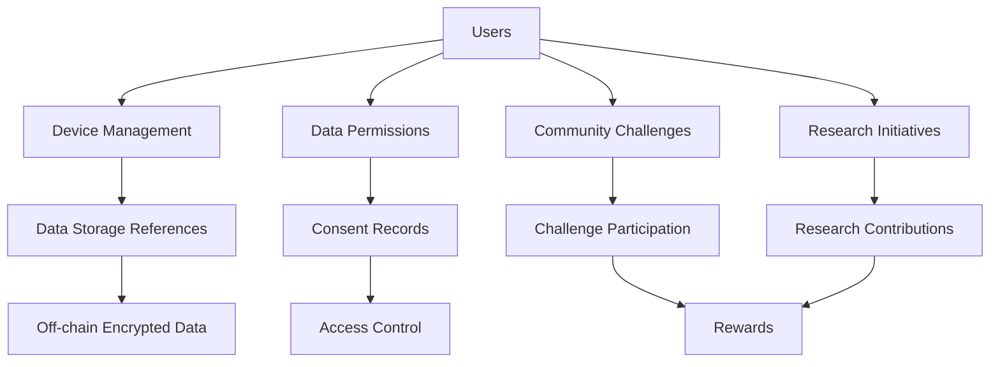

# Health Data Mesh Network

A blockchain-based platform that enables secure sharing and monetization of personal health data from wearable devices, with user-controlled access and opportunities for community engagement and research participation.

## Overview

The Health Data Mesh Network creates a decentralized ecosystem for health data management with the following key features:

- Secure user registration and device management
- Granular data access permissions with transparent consent tracking
- Community health challenges with rewards
- Anonymous data sharing for research initiatives
- Complete user control over health data sharing

The platform enables individuals to maintain ownership of their health information while selectively participating in community activities and research programs.

## Architecture

The system is built around a central smart contract that manages:



Core components:
- User profiles and device registration
- Encrypted data storage references
- Granular permission management
- Challenge and research participation tracking
- Reward distribution system

## Contract Documentation

### health-mesh.clar

The main contract managing all platform functionality.

#### Key Features:

1. **User Management**
   - User registration and profile management
   - Device registration and tracking
   - Account deactivation

2. **Data Management**
   - Storage reference tracking
   - Permission granting/revocation
   - Access logging

3. **Community Features**
   - Health challenge creation and participation
   - Research initiative management
   - Reward distribution

## Getting Started

### Prerequisites
- Clarinet
- Stacks wallet

### Installation

1. Clone the repository
2. Install dependencies:
```bash
clarinet install
```

3. Test the contract:
```bash
clarinet test
```

### Basic Usage

1. Register a user:
```clarity
(contract-call? .health-mesh register-user (some "John") (some "profile-url"))
```

2. Register a device:
```clarity
(contract-call? .health-mesh register-device "device-123" "smartwatch")
```

3. Grant data access:
```clarity
(contract-call? .health-mesh grant-data-permission 
  GRANTEE_PRINCIPAL 
  "heart-rate" 
  u86400 
  "research-study")
```

## Function Reference

### User Management

```clarity
(register-user (name (optional (string-utf8 50))) (profile-data-url (optional (string-utf8 256))))
(update-profile (name (optional (string-utf8 50))) (profile-data-url (optional (string-utf8 256))))
(deactivate-account)
```

### Device Management

```clarity
(register-device (device-id (string-utf8 64)) (device-type (string-utf8 50)))
(update-device-sync (device-id (string-utf8 64)))
(remove-device (device-id (string-utf8 64)))
```

### Data Access Control

```clarity
(grant-data-permission (grantee-id principal) (data-type (string-utf8 30)) (duration uint) (purpose (string-utf8 100)))
(revoke-data-permission (grantee-id principal) (data-type (string-utf8 30)))
(record-data-access (user-id principal) (data-type (string-utf8 30)))
```

### Community Features

```clarity
(create-health-challenge (name (string-utf8 100)) (description (string-utf8 256)) ...)
(join-challenge (challenge-id uint))
(submit-challenge-completion (challenge-id uint))
(claim-challenge-reward (challenge-id uint))
```

## Development

### Testing

Run the test suite:
```bash
clarinet test
```

### Local Development

1. Start Clarinet console:
```bash
clarinet console
```

2. Deploy contract:
```bash
clarinet deploy
```

## Security Considerations

1. **Data Privacy**
   - All actual health data is stored off-chain
   - Only encrypted storage references are maintained on-chain
   - Granular permission control with expiration

2. **Access Control**
   - Time-bound permissions
   - Revocable access rights
   - Transparent consent tracking

3. **Limitations**
   - Contract cannot guarantee off-chain data deletion
   - Users should review permissions regularly
   - Research contributions are one-way and cannot be withdrawn